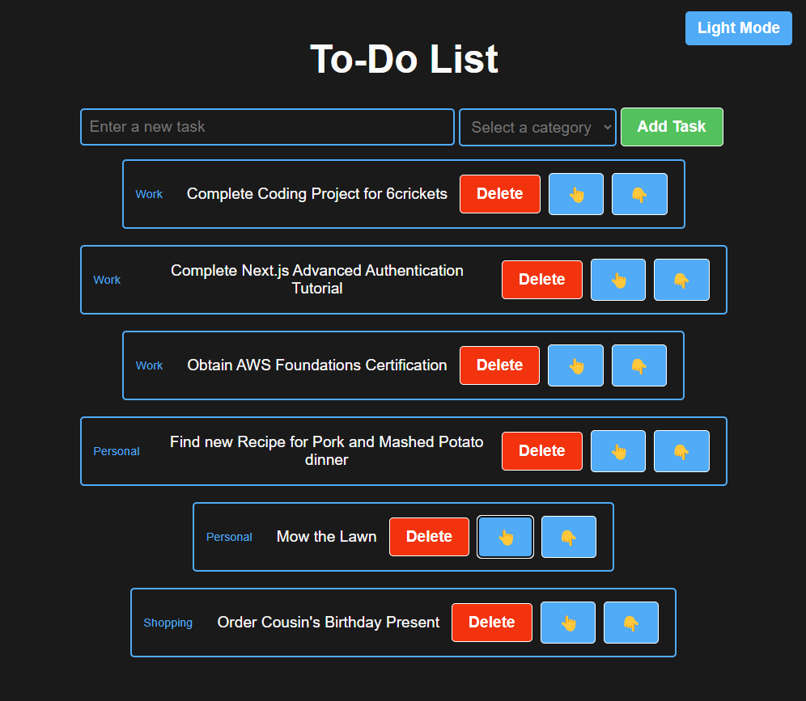

# Simple React Todo List Application

This project is a feature-rich Todo List application built with React. It offers a clean, intuitive interface for managing tasks with categories, dark mode support, and local storage persistence.

## Features

- Task Management: Add, delete, and reorder tasks easily
- Categorization: Organize tasks into categories (Work, Personal, Shopping)
- Filtering: View tasks by category
- Dark Mode: Toggle between light and dark themes for comfortable viewing
- Persistence: Tasks are saved to local storage, persisting between sessions
- Responsive Design: Optimized for various screen sizes

## Components

### App.jsx

The main component that wraps the entire application. It manages the dark mode state and provides the structure for the todo list.

### TodoList.jsx

The core component of the application, handling the following functionalities:

- State management for tasks, categories, and UI elements
- Adding new tasks with categories
- Deleting tasks
- Filtering tasks by category
- Reordering tasks (move up/down buttons)
- Local storage integration for data persistence

### TodoItem.jsx

A reusable component for rendering individual todo items. It displays the task text, category, and action buttons (delete, move up, move down).

### Styling

The application uses a custom CSS file (index.css) for styling, featuring:

- CSS variables for easy theme customization
- Responsive design with flexbox
- Smooth transitions and hover effects
- Dark mode support using CSS variables and data attributes

### How to Use

- Clone the repository
- Install dependencies with npm install
- Run the application with npm start
- Open your browser and navigate to http://localhost:3000

### Future Enhancements

- Implement drag and drop functionality for task reordering
- Add due dates and priority levels for tasks
- Integrate with a backend API for cloud synchronization
- Implement user authentication for personalized todo lists

This Todo List application demonstrates modern React practices, including hooks (useState, useEffect, useCallback), state management, and component composition. It provides a solid foundation for further expansion and customization.
